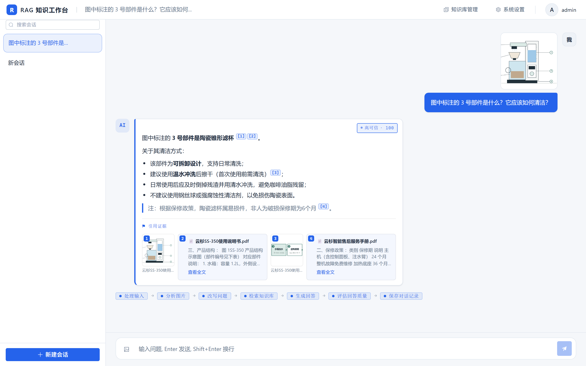
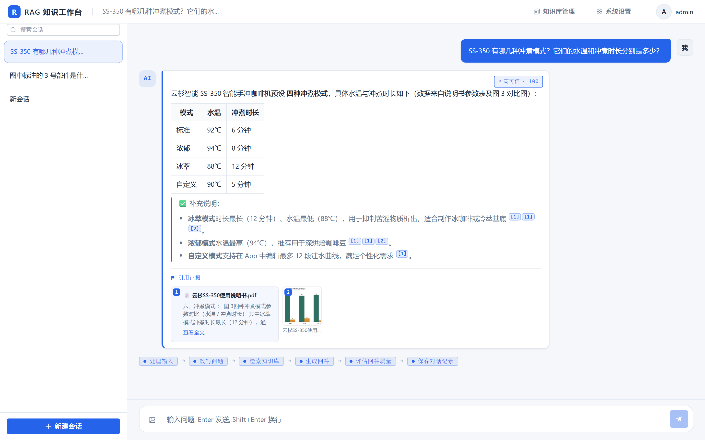

# 多模态 RAG 知识库问答系统

基于 **FastAPI + LangGraph + Milvus + Vue3** 构建的多模态检索增强生成(RAG)问答系统。支持文本与图片(图文混合)检索、图片语义桥接、LLM-as-Judge 回答质量评估与人工审批、多轮上下文管理,以及基于 OCR 的完整文档入库管道。后端通过 SSE 将流式回答推送给 Vue3 聊天界面。

> 项目开发过程中的审计 / 已知问题 / 流程等文档为私有资料,未包含在本仓库中。

---

## 目录

- [项目简介](#项目简介)
- [核心特性](#核心特性)
- [演示效果](#演示效果)
- [系统架构](#系统架构)
- [多模态检索设计](#多模态检索设计)
- [技术栈](#技术栈)
- [目录结构](#目录结构)
- [快速开始](#快速开始)
- [环境变量](#环境变量)
- [系统设置(管理员)](#系统设置管理员)
- [知识库管理(管理员)](#知识库管理管理员)
- [用户管理(管理员)](#用户管理管理员)
- [审核队列(管理员)](#审核队列管理员)
- [API 概览](#api-概览)
- [工程化工具](#工程化工具)
- [生产部署注意](#生产部署注意)
- [License](#license)

## 项目简介

一套**多模态知识库问答系统**:支持以文本或图片(图文混合)提问,对知识库文档(PDF/图片/表格)进行检索增强生成。系统以 LangGraph 状态机编排完整处理链路,并由独立的 LLM-as-Judge 对回答进行质量评估,低置信度回答进入人工审批。

核心差异化能力包括:**图片语义桥接**(以 caption 将图片语义接入文本检索)、**三路并行召回 + RRF 融合**、**图文一致性校验**(识别用户描述与图片内容的矛盾)、**跨会话记忆检索**。

## 核心特性

- **多模态输入与检索**:`image_analysis` 节点为图片生成 caption 以桥接文本语义;文本路 / 图片路 / 记忆路三路并行召回,经 RRF 名次融合去重;图文关系一致性评估,避免无关图片干扰检索。
- **LangGraph 图工作流**:输入 → 图片分析 → 查询改写 → 统一检索 → 生成 → LLM 评审 →(人工审批)→ 持久化;Redis checkpointer 支持**断点续跑**与多轮上下文管理。
- **LLM-as-Judge 评估与人工审批**:由独立评审模型打分(消除自评偏置),低于 `EVALUATE_THRESHOLD` 的回答进入人工审批,可审批通过或驳回重生成。
- **上下文管理**:多轮滑动窗口 + 超长对话自动摘要压缩;跨会话记忆检索(`t_context`),仅高质量回答进入记忆。
- **入库管道**:基于 vllm `dots_ocr` 的文档版面解析与文字识别(OCR),经智能分块与多模态向量化后写入 Milvus,MySQL 记录文档元数据;异步任务 + 进度查询。
- **知识库管理**:管理页支持上传 PDF、任务进度轮询、已入库文档列表(搜索 / 分页)、文档 chunk 明细下钻、按 Milvus 主键精确删除(同名重复上传互不影响)。
- **可观测性**:SSE 流式输出 + 节点执行链路可视化;`turn_trace` 全链路中间过程落库(`message_traces`),只写不回流,可审计、可回放。

## 演示效果

> 演示数据采用 [demo_docs/](demo_docs/) 提供的**虚构样例文档**(示例品牌"云杉智能"及其产品说明书、售后服务手册),全部内容均为虚构,可安全用于公开演示;具体问答用例参见 [demo_docs/README.md](demo_docs/README.md)。

### 多模态问答

上传产品结构示意图并提问,系统通过图像分析识别图中部件,结合知识库检索生成回答,并同时呈现引用证据、置信度评分与执行链路。



### 文本问答

针对文档内容的文本提问,系统返回带引用标注的回答,并展示检索、生成、评估等完整执行链路。



## 系统架构

```
用户输入(文本 / 图片)
   ▼
process_input ──有图──▶ image_analysis     图→caption + 图文一致性
   │ 无图                          │
   ▼                              ▼
query_rewriter     指代消解 / 改写(按模态选源)
   ▼
unified_retrieve   文本路 + 图片路 + 记忆路(RRF 名次融合)
   ▼
generator_node     LLM 生成(输入图 + 检索图 + 历史图进模型)
   ▼
evaluate_node      LLM-as-Judge 评分
   ├─ ≥ 阈值 ─▶ persist_context ─▶ SSE done 事件
   └─ < 阈值 ─▶ human_approval(人工审批中断)
                  ├─ 通过 ─▶ persist_context
                  └─ 驳回 ─▶ regenerate_node ─▶ persist_context
```

- **持久化**:`persist_context` 将回答、图片引用、引用证据、中间 trace 写入 MySQL,高质量回答写入 Milvus 记忆。
- **流式**:后端通过 SSE 下发 `token` / `node_update` / `interrupt` / `done` / `error` 等事件,前端实现打字机效果与审批弹窗。
- **中断恢复**:审批中断点由 Redis checkpointer 保存执行状态,`/approve` 恢复后从中断处继续。

## 多模态检索设计

系统将输入按**三种模态**分别处理——纯文本 / 纯图 / 图文混合,并统一遵循**「入库配方 = 检索配方」对称性原则**,避免图文向量语义错位:

| 通道 | 入库配方 | 检索配方 |
|---|---|---|
| 图→图(以图搜图) | 图片纯视觉向量 | 图片纯视觉向量 |
| 文→图(关键词通道) | 图片描述写入 `text` → BM25 稀疏检索 | 文本查询经 BM25 稀疏检索 |
| 图→文(caption) | 文字文档正常入库 | caption 作为文本查询走文本通道 |

### 三种输入模态的处理

| 模态 | 处理方式 |
|---|---|
| **纯文本** | 原文经术语归一化与 LLM 改写(指代消解 / 上下文补全)后,走文本与记忆检索 |
| **纯图** | 视觉语言(VL)模型生成图片描述(caption),作为文本查询检索知识库(以文找图);原图同时走以图搜图通道 |
| **图文混合** | 生成 caption 并判断图文关系,按关系决定检索源组合与图片通道(见下文) |

### 图文一致性(relation 三态)

图文混合时,系统判断用户文字与图片的关系,并据此调整检索与生成:

- **相关(related)**:图片描述与用户文字融合后共同检索,图文信息互补,召回最全。
- **不相干(unrelated)**:图片视为附件,仅作生成参考、不参与检索,避免无关图片污染召回。
- **矛盾(contradictory)**:以图片真实内容为准——检索仅使用图片描述(避开用户错误描述),生成时礼貌指出用户描述与图不符。

### 记忆检索

跨会话的过往高质量问答写入 `t_context`,检索时并入统一召回结果并附带来源标签。

### 消息记录的忠实性

会话历史忠实保存用户原始输入(原话与图片);检索改写、图片描述等中间产物作为旁路信息记录,不修改原始消息内容,保证对话记录可审计、可回放。

## 技术栈

| 层 | 技术 |
|---|---|
| 后端 | Python / FastAPI / SQLAlchemy(async) / LangGraph / LangChain / DashScope embedding / pymilvus |
| 前端 | Vue3 / Vite / TypeScript / Element Plus / Pinia |
| 存储 | MySQL(业务数据)、Milvus(向量)、Redis(graph checkpointer) |
| 依赖服务 | OpenAI 兼容 LLM 服务(默认 `localhost:8000/v1`);vllm + `dots_ocr`(文档解析 OCR,PDF 入库必需) |

## 目录结构

```
backend/
  api/         路由层(auth / chat / knowledge / sessions / files)
  core/        配置、依赖注入、JWT 安全
  db/          MySQL 连接与 schema_v2.sql(表结构参考)
  graph/       LangGraph 工作流节点(检索 / 生成 / 评估 / 持久化 / 图片分析)
  ingestion/   入库管道(PDF / OCR / 分块 / 向量化 / 任务)
  models/      SQLAlchemy ORM 模型
  services/    业务服务层(认证 / 会话 / 消息 / 图片存储)
  main.py      FastAPI 应用入口
frontend/
  src/views/   页面
  src/api/     axios 封装(/api 代理到后端)
  vite.config.ts  dev 代理:/api、/uploads → http://localhost:8001
```

## 快速开始

### 前置依赖

| 依赖 | 说明 |
|---|---|
| MySQL | 业务数据(会话 / 消息 / 入库任务)。首次启动自动建表(create_all + 幂等迁移) |
| Redis | 需 **Redis 8.0+ 或 Redis Stack**(RediSearch + RedisJSON 模块),用于 LangGraph checkpointer |
| Milvus | 向量库。`MILVUS_URI` 可指向独立服务,或默认本地文件(Milvus Lite) |
| LLM 服务 | 任意 OpenAI 兼容端点(默认 `http://localhost:8000/v1`),建议配置独立评审模型 `JUDGE_LLM_MODEL` |
| vllm + dots_ocr | 文档版面解析与文字识别(OCR),**PDF 入库必需**;未部署时无法完成 PDF 文档解析 |

### 后端启动

```bash
cd backend
cp .env.example .env      # 按需修改数据库 / LLM / Redis / OCR 配置
pip install -r requirements.txt
uvicorn main:app --reload --port 8001
```

> **首次部署需初始化 Milvus 集合**(幂等,已存在则跳过;`--force` 删除重建会清空数据):
>
> ```bash
> cd backend && python -m db.milvus_setup
> ```

### 前端启动

```bash
cd frontend
npm install
npm run dev               # http://localhost:5173
```

### 首次使用

首次启动会自动创建管理员账号:

```
用户名: admin
密码:   admin123
```

> ⚠️ **首次登录强制改密**:登录后系统会要求先修改初始密码,否则无法进入系统(路由拦截)。对存量升级部署,已有账号同样会被标记一次强制改密,改密成功后自动解除。
> 生产环境请务必替换 `.env` 中的 `JWT_SECRET`(缺省 / 占位值会导致启动拒绝,过短会触发告警)。

## 环境变量

所有**基础设施**配置集中在 `backend/.env`(模板见 `backend/.env.example`)。

> ⚙️ **运行参数已迁移至「系统设置」页**(schema_v3 配置中心):召回 topK、分片字符数、评估阈值、上下文窗口等运行参数不再由 `.env` 或代码控制,改为管理员在系统设置页可视化配置,落库 `sys_config` 表并即时热加载生效。详见下文「系统设置」。

| 类别 | 变量 | 说明 |
|---|---|---|
| 存储 | `MYSQL_URL` | MySQL 连接串 |
| | `REDIS_URL` | Redis 连接串(checkpointer) |
| | `MILVUS_URI` | Milvus 地址(服务或本地文件) |
| 认证 | `JWT_SECRET` / `JWT_ALGORITHM` / `JWT_EXPIRE_MINUTES` | JWT 签发与有效期 |
| LLM | `LLM_BASE_URL` / `LLM_API_KEY` | 生成模型端点 |
| 入库管道 | `OCR_VLLM_IP` / `OCR_VLLM_PORT` / `OCR_VLLM_MODEL` | 文档解析 OCR 服务地址 |
| | `INGEST_OUTPUT_DIR` / `INGEST_IMAGES_DIR` / `INGEST_TMP_DIR` | 入库中间产物目录 |
| | `INGEST_OCR_THREADS` / `INGEST_OCR_DPI` | OCR 并发与分辨率 |
| 图片存储 | `UPLOAD_IMAGES_DIR` | 消息图片落盘目录(经 `/uploads` 静态暴露) |
| | `KB_IMAGE_ROOTS` | 额外允许 `/api/files` 提供的图片根目录(分号分隔) |
| 其他 | `CORS_ORIGINS` | 允许的前端来源(逗号分隔) |

## 系统设置(管理员)

管理员可在顶栏「系统设置」页(schema_v3 配置中心)对运行参数进行可视化配置,参数落库 `sys_config` 表:

- **分组**:按入库 / 检索 / 评估 / 上下文 / 图片上限分组,组内按逻辑子域(分片 / 向量化 / 候选数 / 融合 / 阈值…)呈现,支持按组保存与恢复默认值。
- **生效方式**:全部即时生效(保存即写入并热加载)。
- **配置范围**:仅收录实际需要调参且已接线的运行参数,包括检索召回(topK)、评估阈值、分片字符数、上下文窗口、图片上限。模型型号 / 温度 / 维度、OCR 线程 / DPI、限流等基础设施配置仍归属 `.env`(重启级),不在设置页内。
- **实现位置**:配置项定义见 `backend/core/config_defaults.py`,读写逻辑见 `backend/models/config.py` 与 `backend/services/config_service.py`。

## 知识库管理(管理员)

「知识库管理」页提供上传、任务调度与已入库文档的完整管理能力:

- **统一文件列表**:已入库文档与进行中任务在同一列表中展示。进行中 / 失败 / 已取消任务行内嵌**进度条与管道步骤条**(解析:上传 → OCR → 分片;索引:描述 → 向量化 → 入库,分阶段显示完成 / 进行中 / 待执行),无需单独的"入库任务"页。
- **两段式管道(可复用)**:解析(OCR / 分片)产物 `chunks.json` 落盘,索引(描述 / 向量化 / 入库)从落盘读取——更换嵌入模型或重跑索引无需重新 OCR / 分片;失败重试自动只重跑失败段。
- **手动分步控制**:上传时可勾选「手动控制(分步)」,上传后不自动处理,可分别点击「解析」(OCR / 分片)与「入库」(描述 / 向量化 / 写入)分步执行;解析完成后停在「待入库」状态。
- **行内操作**:进行中任务支持**暂停**(阶段边界及向量化循环内逐条)、**继续**、**取消**;失败 / 已取消任务支持**删除**(清理记录与中间产物)或**重试**(复用原 job_id,只重跑失败段);每行可查看**任务日志**。
- **先不处理**:上传时勾选「上传后先不处理」,任务停在首阶段(如仅上传、暂不 OCR),后续在列表中点击「继续」。
- **中间数据清理**:任务成功 / 取消后自动清理其 OCR 产物目录与临时 PDF;图片目录(md5 内容哈希共享)保留。
- **文档统计**:列表与详情展示 chunk 数、图片数、字符数、源文件大小,支持按状态 / 关键字筛选,文档内每个 chunk 展示字符数。
- **知识库统计条**:文档数 / 向量数 / 总字符数 / 失败任务数 / Milvus 状态。

## 用户管理(管理员)

「用户管理」页(管理工作台第三个标签页)提供用户与角色管理:

- **创建用户**:可新建普通用户或管理员,新用户首次登录强制改密。
- **角色调整 / 启用禁用**:角色下拉就地修改;账号被禁用后无法登录(会话与消息历史保留)。
- **重置密码**:管理员设置新密码,重置后该用户首次登录强制改密。
- **删除用户**:删除账号及其关联的会话与消息。
- **自我保护**:不允许修改自身角色、禁用或删除自己;系统强制至少保留一个管理员。
- **登录校验**:被禁用账号登录返回 403「账号已被禁用」。

## 审核队列(管理员)

「审核队列」页(管理工作台第四个标签页)作为人工审批流程的补充:

- **按角色分流**:管理员会话中的低分回答仍走**即时审批中断**(原流程);普通用户会话中的低分回答不中断、直接交付,自动标记待审进入本队列。
- **处理方式**:查看待审回答(问题 / 回答 / 评分)后可选择**通过**或**忽略**(忽略会清除标记并记录处理动作)。
- **记忆质量线**:普通用户的回答仍受记忆质量线约束,低分回答不写入跨会话记忆。

## API 概览

所有接口统一前缀 `/api`:

| 方法 | 路径 | 说明 |
|---|---|---|
| POST | `/auth/login` | 登录,返回 JWT |
| GET | `/auth/me` | 当前登录用户 |
| GET | `/sessions` | 会话列表 |
| POST | `/sessions` | 新建会话 |
| GET | `/sessions/{id}/messages` | 会话历史消息(含图片与引用证据) |
| PATCH | `/sessions/{id}` | 重命名会话 |
| DELETE | `/sessions/{id}` | 删除会话(同时清理 Redis checkpointer) |
| POST | `/sessions/{id}/chat` | 对话(SSE 流式) |
| POST | `/sessions/{id}/approve` | 人工审批(通过 / 驳回重生成) |
| POST | `/knowledge/upload` | 上传 PDF 触引入库任务 |
| GET | `/knowledge/jobs` | 入库任务列表(按状态筛选) |
| GET | `/knowledge/jobs/{id}` | 入库任务状态(含进度 / 阶段明细 / 日志) |
| POST | `/knowledge/jobs/{id}/retry` | 重试失败入库任务(复用原 job_id) |
| POST | `/knowledge/jobs/{id}/cancel` | 取消 running/pending 任务(协作式) |
| GET | `/knowledge/status` | 知识库统计(文档数 / 向量数 / 字符数 / 失败任务) |
| GET | `/knowledge/documents` | 已入库文档分页列表(搜索 / 状态 / 类型筛选) |
| GET | `/knowledge/documents/{id}/chunks` | 某文档的 chunk 明细(文本 / 图片,含字符数) |
| DELETE | `/knowledge/documents/{id}` | 删除文档(含 Milvus 向量与磁盘产物) |
| GET | `/config` | 系统设置:分组返回全部运行参数(仅管理员) |
| PUT | `/config` | 批量更新运行参数(仅管理员) |
| POST | `/config/{group}/reset` | 恢复某组默认值(仅管理员) |
| GET | `/files` | 图片服务(带路径穿越校验) |
| GET | `/health` | 健康检查 |

### 对话流 SSE 事件

`/chat` 与 `/approve` 返回 `text/event-stream`,事件体为 `{ type, ... }`:

| 事件 | 说明 |
|---|---|
| `token` | LLM 流式 token(打字机效果) |
| `node_update` | 节点执行进度(前端展示执行链路) |
| `title_update` | 首轮自动生成会话标题 |
| `interrupt` | 命中人工审批(携带草稿答案与评分) |
| `done` | 回答完成(携带最终文本、引用证据、置信分) |
| `error` | 执行异常 |

## 工程化工具

静态检查与格式化命令(本项目不维护业务测试,提交 / 改动前建议执行):

```bash
# 后端: Python lint(ruff, 查未用导入/未定义/常见 bug) + 格式化
cd backend && ruff check . && ruff format --check .

# 前端: ESLint(lint) + Prettier(格式) + vue-tsc(类型)
cd frontend && npm run lint && npm run format:check && npm run type-check
```

- 后端规则集中在 `backend/pyproject.toml`(`dots_ocr` 第三方库排除)。
- 前端规则在 `frontend/.eslintrc.cjs` + `frontend/.prettierrc`;自动修复分别执行 `npm run lint:fix` / `npm run format`。
- 改动代码后保持上述命令通过;CI(如后续接入)会在此基础上自动门禁。

## 生产部署注意

- **Redis**:checkpointer 依赖 RediSearch + RedisJSON,须使用 **Redis 8.0+ 或 Redis Stack**;生产建议开启持久化(RDB/AOF),否则服务重启会丢失工作流状态与中断进度。Redis 不可用时自动降级为 `InMemorySaver`(仅开发用)。
- **凭据**:`.env` 中 `JWT_SECRET`、`LLM_API_KEY`、`MYSQL_URL` 的默认值仅用于本地开发,上线前必须替换;首次启动自动创建的 `admin/admin123` 应立即修改。
- **数据库**:表结构首次启动自动创建;`backend/db/schema_v2.sql` 提供参考 DDL。
- **评估模型**:生产建议评审模型(`model.judge`,系统设置页配置)与生成模型**不同系列**,避免自评偏置。
- **图片目录**:`/uploads` 与 `/api/files` 对外暴露图片文件,部署时注意访问权限与 `KB_IMAGE_ROOTS` 配置范围。

## License

本仓库暂未指定 License。
